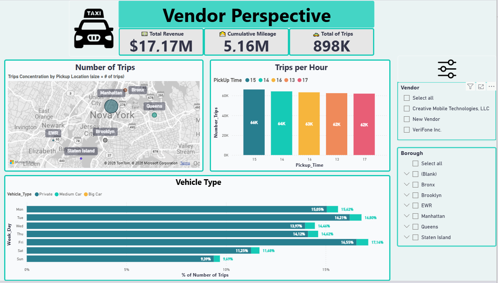
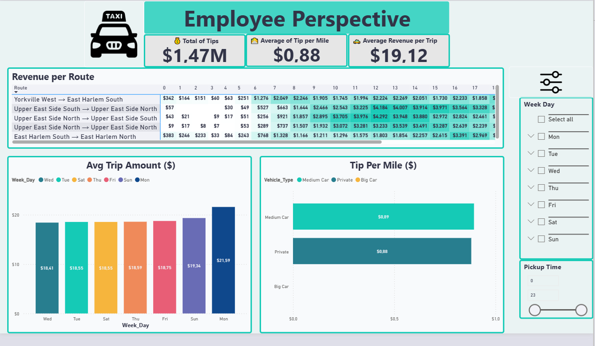

# Power BI Analysis – NYC Yellow Taxis

## Project Overview
This project analyzes **NYC Yellow Taxi trip data** using **Power BI**, focusing on operational and business performance from two complementary perspectives:

- **Vendor Perspective** – Regional and volume-focused analysis  
- **Employee (Driver) Perspective** – Operational efficiency and profitability analysis  

The project was developed as part of a **Data Analyst training program** and aims to support **data-driven decision-making** through interactive dashboards and clear visual storytelling.

---

## Business Objectives
- Analyze taxi performance at a **regional and temporal level**
- Identify **high-demand areas and peak operating hours**
- Understand **vehicle usage patterns**
- Evaluate **profitability by day, hour, route, and vehicle type**
- Provide **actionable recommendations** for vendors and drivers

---

## Dataset
- **Dataset:** NYC Yellow Taxi trip data (educational dataset)
- **Data content includes:**
  - Pickup and drop-off timestamps
  - Trip distance
  - Passenger count
  - Pickup and drop-off locations
  - Vehicle type (derived from passenger count)
  - Fare, tip, tolls, and total amount
- **Distance unit:** Miles

---

## Data Preparation & Modeling
- Reviewed and validated all columns based on data dictionary  
- Created calculated columns and measures for:
  - Total revenue
  - Number of trips
  - Average revenue per trip
  - Tip per mile
- Derived **vehicle types** based on passenger count:
  - Private (1–4 passengers)
  - Medium Car (5–6 passengers)
  - Big Car (7+ passengers)
- Created time-based fields (hour, weekday)
- Built a clean **data model** to support both perspectives

---

## Vendor Perspective – Key Analysis
The vendor perspective focuses on maximizing the **number of trips and regional coverage**.

### Business Questions Answered:
- Distribution of **vehicle types by day of the week**
- Top **5 pickup hours** with the highest number of trips
- Geographic areas with **highest taxi demand**

### Key Insights:
- **Private cars** dominate service volume across all weekdays  
- Highest trip demand occurs between **13h and 17h**, with peaks at **15h–16h**  
- **Manhattan** accounts for over **85% of total trips**, followed by Queens and Brooklyn  

---

## Employee (Driver) Perspective – Key Analysis
The employee perspective focuses on **profitability and operational efficiency**.

### Business Questions Answered:
- Which **two days of the week** have the highest average income per trip?
- Which **vehicle type** generates the highest **tip per mile**?
- Which **routes are most profitable by time of day**?

### Key Insights:
- **Monday** shows the highest average revenue per trip  
- **Sunday** is the second most profitable day  
- **Medium Cars** generate the highest average tip per mile  
- Profitability varies significantly by **route and time window**, with:
  - Night routes (18h–23h) showing strong performance
  - Specific routes dominating different time ranges

---

## Dashboard & Visualizations
Two interactive Power BI dashboards were created:
- **Vendor Dashboard** – Regional performance, trip volume, vehicle distribution  
- **Employee Dashboard** – Revenue, tips, profitability by day, hour, route, and vehicle type  

Dashboards include:
- KPI cards
- Maps
- Bar and line charts
- Tables and matrices
- Slicers for dynamic filtering

---

## Dashboard Preview

### Vendor Perspective

### Employee Perspective

---

## Project Deliverables
- Power BI Dashboards (PBIX – developed locally)
- Presentation (PDF) summarizing business questions, insights, and recommendations

> Due to account limitations, the Power BI file cannot be shared publicly.  
> Visual previews and the presentation are provided in this repository.

---

## Tools Used
- **Power BI**
  - Power Query
  - Data Modeling
  - DAX Measures
  - Interactive Dashboards
  - Slicers and Filters

---

## Repository Structure
├── dashboard/

│ ├── vendor_dashboard.png

│ └── employee_dashboard.png

├── presentation/

│ └── Analise_Yellow_Taxis_NYC.pdf

└── README.md

---

## What I Learned
- Data preparation and modeling in Power BI  
- Creating business-focused KPIs with DAX  
- Designing dashboards for different stakeholders  
- Translating operational data into actionable insights  
- Building clear and interactive data visualizations  

---

## Author
**Luís Machado**  
Junior Data Analyst  

**Tools:** SQL | Excel | Power BI | Python  
